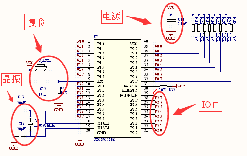

# 第三节：单片机最重要的一个特性

## 【3.1 单片机的 “一”】

▲图 3.1 单片机工作的最小系统

“道生一，一生二，二生三，三生万物。”《道德经》认为，世间万物，缤纷多彩，都源自一个东西，这个 “一” 的东西就是 “道”。电子世界也存在 “一”，这个 “一” 繁衍出手机、电脑、电视机、机器人等丰富多彩的电子世界，这个 “一” 就是单片机最重要的一个特性：“程序下载进内存后，单片机既可以通过管脚识别外部输入的高低电平信号，也可以通过管脚对外部输出不同时间长度的高低电平。” 这句话有 5 个关键词 “程序、内存、管脚、电平、时间。” 下面我详细解读每个关键词的含义，涉及到某些专用名词如果不理解也没关系，主要是让大家有个感性的认识就足矣。

## 【3.2 程序】

单片机程序有 3 种：C 程序、汇编程序、机器程序。能下载进单片机的只有机器程序，C 程序和汇编程序都不能直接下载进单片机，所以 C 程序和汇编程序都要经过编译软件翻译成机器程序后，才能下载进单片机。程序是语言，语言是用来交流，交流就必须存在两个对象，对象分别是程序员和单片机。程序员是人所以用 C 或者汇编语言，单片机是机器所以用机器语言，人和机是不同的世界，两者交流就需要一个翻译家，翻译家就是编译软件，俗称编译器，它能把 C 语言或者汇编语言翻译成单片机能识别的机器语言。机器语言就是 0101 的代码，一般以十六进制的形式呈现。

理论上，程序员也可以抛开 C 和汇编语言，直接用机器语言做项目。我读书时老师让我们做实验就是这么整。那时我还不知有烧录器，老师让我们先用汇编语言写好程序，然后自己充当编译器，对照汇编语言和机器语言的指令表，人工把汇编语言翻译成十六进制的机器语言，最后把机器语言按字节一个一个的输入到特定的实验设备来观察现象。现在回想起来，老师当时的初衷是让我们了解编程语言的本质。

既然可以直接用机器语言做项目，为什么还要 C 语言或者汇编语言？在 C 语言或者汇编语言没有诞生前，程序员就是通过在纸带上打孔来代表 01 的机器语言，此时相当于结绳记事的原始阶段。后来人类发明了汇编语言，通过英语单词来表示 01 机器语言特定的指令语句，此时开始诞生了汇编语言的编译器相当于进入象形文字的阶段。再到后来人类又发明了 C 语言，通过数学符号和英语单词来表达自己的逻辑，诞生了 C 语言的编译器相当于进入了汉字白话文阶段，从此程序员写出来的 C 程序就非常方便移植，编辑，阅读，传播，继承。现在单片机开发的主流是 C 语言，我本人出来工作后就没有用过汇编做项目开发。C 语言是必修课，汇编语言是选修课；C 语言是白话文简单易懂，汇编语言是文言文繁琐难读。当然汇编也有它的应用场合，汇编的翻译效率高，往往是一句汇编语言对应一句机器语言，而一句 C 语言有可能对应几句机器语言，这样 C 程序的代码效率在很大程度上取决于编译器的水平，编译器能不能帮你翻译出高效的机器语言对于我们来说往往像黑盒子，不像汇编语言那么可控制。所以很多嵌入式系统某段要求简洁高效的源代码往往用汇编来写，也有少数一些很便宜的单片机不提供 C 编译器，只能用汇编语言开发。要不要学汇编，最好根据个人的工作需求来决定。

## 【3.3 内存】

单片机就像 MP3，程序代码就像歌曲，把不同的歌曲下载到 MP3 里就可以听到不同的音乐，把不同的程序下载到单片机里，单片机就能做不同的事。能装程序的单片机必然有内存，内存由 ROM 和 RAM 组成，ROM 和 RAM 都能装东西，但各有不同。

ROM 的优点是存储的东西断电后不会丢失，缺点是存储的东西上电后不能更改，想要改变 ROM 的内容除非重新下载程序，而且下载次数有限制，FLASH 的 ROM 最大次数通常是 10 万次，而 OTP 的 ROM 只能下载 1 次，所以平时上电工作时 ROM 存储的东西是不能更改的，某些具有 IAP 功能的高级单片机不在此讨论范围内。而 RAM 恰好反过来，RAM 的优点是存储的东西上电后可以随时被单片机更改，更改次数没有限制，缺点是存储的东西断电后会丢失，没有记忆功能。

ROM 和 RAM 各有特点，单片机从中各取所长。ROM 用来存储不可更改的指令代码和常量数据，ROM 的容量往往相当于代码的容量。RAM 用来存储可以被更改的变量数据，RAM 的容量往往相当于全局变量和局部变量的容量。不管是用 C 语言还是汇编，所写的程序代码就自然包含了指令代码、常量数据、全局变量、局部变量，那么谁在幕后帮我们进行分类存储，谁把一个程序代码的一分为二让它们在 ROM 和 RAM 里各就各位？是编译器软件和下载器 (烧录器)，编译器除了把 C 语言翻译成机器语言之外，还帮我们分好了类，分配好了存储的地址和位置，下载器 (烧录器) 再根据这些信息把程序存储到内存中，这些工作一般不用程序员干预，它们自动完成。

## 【3.4 管脚】

管脚是单片机与外部电路进行能量和信息交互的桥梁。有电源，复位，晶振和 IO 口这 4 类管脚。

第一类电源管脚。是给单片机内部电路供电的接口。单片机有两种常用的供电电压，一般是 3.3V 或者 5V，有的单片机两种电压都兼容。

第二类复位管脚。单片机上电后需要外部电路给它一个瞬间高电平或者低电平的复位信号，才能启动工作。复位电路通常是由电容和电阻组成的充电电路来实现，也有一些系统是用专门的复位芯片来实现。

第三类晶振管脚。任何单片机想要工作必须要有晶振。单片机执行程序指令是按一个节拍一个节拍来执行的。这个节拍的时间就是由晶振产生，所以把晶振比喻成单片机的心脏是非常恰当的。现在也有很多单片机直接把晶振集成到内部，这类单片机不用外接晶振也可以。

第四类 IO 口管脚。这是跟我们编写程序关联最密切的管脚。前面提到的电源，复位，晶振这 3 种管脚是为了让单片机能工作，俗称单片机工作的三要素。而单片机工作的具体内容就是通过 IO 口管脚来体现的。比如，IO 口能识别按健的输入，也能输出驱动继电器工作的开关信号，也能跟外围器件进行通信。

## 【3.5 电平】

电平就是电压的两种状态，低或者高，低相当于程序里的 0，高相当于程序里的 1。单片机 IO 口管脚检测到的电压低于或等于 0.8V 时是低电平，程序里读取到的是 0 数字。单片机 IO 口管脚检测到的电压高于或等于 2.4V 时是高电平，程序里读取到的是 1 数字。必须注意的是，IO 口输入的最大电压不能超过单片机的供电电压。单片机输出的低电平是 0V，单片机输出的高电平等于它的供电电压值，往往是 3.3V 或者 5V。

## 【3.6 时间】

时间是单片机程序必不可少的元素。跟外围芯片通信的时序节拍需要时间，驱动发光二极管闪烁需要时间，工控自动化的某些延时需要时间。单片机的时间来源自两方面。第一方面源自指令的周期时间。单片机是根据节拍来执行程序指令的，每执行一条指令都要消耗一点时间，只要让程序执行的指令数量越多，产生的时间就越长，通过调整所执行指令的数量就可以得到所需的时间长度。第二方面源自单片机内部自带的定时器。假如设置定时器每 20 毫秒产生一次中断，现在要获取 10 秒钟的时间，只需在程序里统记 500 次定时中断就可以了，因为 1 秒等于 1000 毫秒。指令和定时器这两者的时间最后都来源于晶振。

## [◀回到目录](https://xdrive5.github.io/mcu_frame_2019/000.目录)
上一篇：[002.初学者的疑惑](https://xdrive5.github.io/mcu_frame_2019/002.初学者的疑惑)

下一篇：[004.平台软件和编译器软件的简介](https://xdrive5.github.io/mcu_frame_2019/004.平台软件和编译器软件的简介)

***
