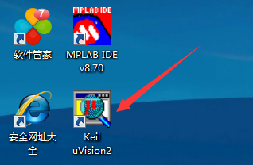
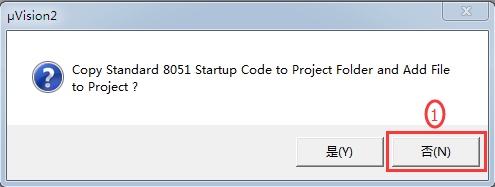

# 第五节：用 Keil2 软件关闭，新建，打开一个工程的操作流程

## 【5.1 本教程选择 Keil2 软件版本的原因】

Keil 软件目前有 Keil2，Keil4，Keil5 等版本。本教程之所以选用 Keil2 版本，是因为 Keil2 版本比较单纯，它本身内置了 C51 编译器，并且只适用于 51 单片机不能适用于 STM32 这类单片机。而 Keil4，Keil5 等版本不仅可以适用于 51 单片机的，还可以适用于 ARM 类的单片机，它们有 C51 编译器和 MDK-ARM 编译器两种选择，在同一个 Keil4 或者 Keil5 版本里，C51 和 MDK-ARM 两者往往只能二选一，MDK-ARM 编译器是针对 STM32 这类单片机，如果你电脑上用了 MDK-ARM 编译器想再切换到 C51 编译器就很麻烦了往往不兼容，为了电脑上既能用 C51 编译器，又能兼容 MDK-ARM 编译器，我的电脑上是同时安装了 C51 编译器的 Keil2 和 MDK-ARM 编译器的 Keil4, 一台电脑同时安装 Keil2 和 Keil4 不会冲突，能兼容的。

## 【5.2 如何在不用关闭 Keil2 软件的前提下又能关闭当前被打开的工程？】

要关闭当前工程，最简单的方法是直接点击 Keil2 软件右上角的 “X” 直接把 Keil2 软件也一起关了，这种方法不在讨论范围，现在要介绍的是如何在不关闭 Keil2 软件的前提下又能关闭当前被打开的工程。



▲图 5.2.1 启动 Keil2 软件

### 第一步：启动 Keil2 软件。

1. 双击桌面”Keil uVision2”的图标启动Keil2软件。
2. 双击桌面”Keil uVision2” 的图标启动 Keil2 软件。


▲图 5.2.2 关闭被打开的已有工程

### 第二步：关闭被打开的已有工程。

启动 Keil2 软件后，假设发现此软件默认打开了一个之前已经存在的工程。关闭已有工程的操作是这样子的：点击上面”Project” 选项，在弹出的下拉菜单中选择 “Close Project” 即可。这时 Keil2 软件处于 “空” 的状态，没有打开任何工程了。

## 【5.3 Keil2 如何新建一个工程？】


▲图 5.3.1 新建一个工程文件夹

### 第一步：新建一个工程文件夹。

在电脑 D 盘目录下新建一个文件夹，取名为 “stc89c52rc”。

补充说明：
* （1）文件夹的命名以及后面涉及到的工程文件名统统都不要用中文，请全部用英文，数字，或者下划线这些字符。即使 Keil 软件支持中文名，我建议也不要用中文名，因为在单片机这个行业，有一些单片机厂家提供的平台软件，某些版本是不支持中文名的，所以大家从一开始就养成这个习惯，以后可以避免遇到一些不必要的麻烦。
*  （2）新建的文件夹请直接放在某盘的根目录下，而不要放到某个已有文件夹的目录下。一方面是因为已有的文件名目录往往带有中文单词，另外一方面是有一些单片机厂家的平台软件不支持嵌入层次太深的文件目录，所以大家从一开始就养成这个习惯，以后可以避免遇到一些不必要的麻烦。

### 第二步：启动 Keil2 软件。

双击桌面”Keil uVision2” 的图标启动 Keil2 软件。

### 第三步：关闭默认被打开的已有工程。

启动 Keil2 软件后，如果发现此软件默认打开了一个之前已经存在的工程，请先关闭此工程让 Keil2 软件处于 “空” 的状态，如果没有发现此软件默认打开已有工程，这一步可以忽略跳过。关闭已有工程的操作是这样子的：点击上面”Project” 选项，在弹出的下拉菜单中选择 “Close Project” 即可。这时 Keil2 软件处于 “空” 的状态，没有打开任何工程了。


▲图 5.3.4.1 新建一个工程


▲图 5.3.4.2 选择新建工程保存的位置


▲图 5.3.4.3 为当前工程选择编译器所支持的单片机型号



▲图 5.3.4.4 不需要把默认启动文件添加进来

### 第四步：利用工具向导新建一个工程。

点击上面”Project” 选项，在弹出的下拉菜单中选择 “New Project...”，在弹出的对话框中，选择保存的目录是刚才第一步新建的文件夹 “stc89c52rc”，同时输入跟文件夹名称一样的工程文件名 “stc89c52rc”，然后单击 “保存” 按键（一个新工程模板就建成了），单击 “保存” 按键后此时会弹出一个选择单片机型号的对话框，单击”Atmel” 这个厂家前面的 “+” 号，在展开的下拉选项中选中 “AT89C52” 这个型号，然后点击 “确定”，此时会弹出一个英文询问框，大概意思是 “是否要复制 STARTUP.A51 这个文件到工程里？” 我们单击 “否” 即可。

补充说明：
* （1）以上新建的保存文件名应该跟我们第一步在 D 盘新建的文件夹名称一致，确保都是 “stc89c52rc”，因为有一些单片机厂家的平台软件是有这个要求的，所以大家养成这个习惯，以后可以避免遇到一些不必要的麻烦。
* （2）上面之所以选择 Atmel 厂家的 AT89C52 单片机，是因为本教程选用的单片机 STC89C52RC 跟 AT89C52 是兼容的。
* （3）在弹出的英文询问框，大致意思是 “是否要复制 STARTUP.A51 这个文件到工程里？”，那么 STARTUP.A51 这个文件有什么含义？STARTUP.A51 是一个启动程序文件，在单片机进入.c 程序执行 main 函数之前，先去执行这个启动程序，这个启动程序是专门用来初始化 RAM 和设置堆栈等，如果我们选 “否” 不添加这个启动程序，编译器也会自动加入一段我们不能更改的默认启动程序。如果选 “是”，那么这个文件就会出现在我们工程里，我们可以根据需要对它进行更改。但是大多数的情况下，我们都不会去更改此文件，所以无论你选 “是” 还是 “否”，只要你不更改 START.A51 文件，对我们来说都是一样的。因此我本人一般情况下都是选 “否”。


▲图 5.3.5.1 新建一个源文件


▲图 5.3.5.2 保存当前新建的源文件


▲图 5.3.5.3 把当前源文件保存在指定的位置

### 第五步：新建一个.c 源文件。

点击上面”File” 选项，在弹出的下拉菜单中选择 “New...”，会看到弹出来一个名字为”Text1” 的文件。再一次点击上面”File” 选项，在弹出的下拉菜单中选择 “Save”，会弹出一个保存的对话框，此时还是选择保存在第一步新建的文件夹目录下，并且把 “Text1” 文件名更改为 “stc89c52rc.c”（注意后缀是.c 扩展名），单击 “保存”。

补充说明：
* （1）此时你如果打开 D 目录下 “stc89c52rc” 的文件夹，你会发现此文件夹有一个 “stc89c52rc.c” 的文件，这个文件就是在这一步被新建添加进来的，但是此文件 “stc89c52rc.c” 目前跟整个工程还没有关联，还需要在接下来的第六步那里进行关联操作。
* （2）上面新建添加的文件，它的文件名必须是带.c 这个扩展名，表示此文件是 C 文件格式，这一个很重要不要搞错了。往后我们所写的 C 语言程序代码就是写在此 C 格式的文件里。此文件也俗称 C 源文件。


▲图 5.3.6.1 即将把源文件添加进工程里


▲图 5.3.6.2 选择需要添加进工程里的源文件


▲图 5.3.6.3 源文件添加成功

### 第六步：把刚才新建的.c 源文件添加到工程里，跟当前工程关联起来。

点击左边竖着的选项框里面的”Target 1” 前面的 “+” 号，在展开的下拉菜单下看到 “Source Group 1”。右键单击 “Source Group 1” 选项，在下拉菜单中选择 “Add Files to Group ‘Source Group 1’” 选项，弹出一个文件选择对话框，单击选中刚才新建的.c 源文件，然后单击一次 “Add” 按钮，此时虽然对话框没有关闭，但是已经悄悄地把.c 源文件添加到工程里了（这个地方 Keil 的用户体验设计得不够好，容易让人误解还没有把文件添加进来），这时再点击一次 “Close” 按钮先把此对话框关闭，然后发现左边的 “Source Group 1” 前面多了一个”+” 号，单击此”+” 号展开，发现下面的文件恰好是刚才新添加进去的.c 源文件 “stc89c52rc.c”。

补充说明：
*  （1）在刚才的操作中，我本人觉得 Keil 软件有一个地方的用户体验做得不够好，容易引起误解。就是在弹出一个文件选择对话框时，先单击选中刚才新建的.c 源文件，此时单击一次 “Add” 按钮，已经相当于把.c 文件添加进工程了，但是此时 Keil 软件并没有自动关闭对话框，这样很容易让初学者误以为.c 源文件还没有被添加进去。


▲图 5.3.7 编辑 C 语言代码的区域

### 第七步：至此，可以正常的编辑 C 语言代码了。

双击打开左边 Target1 里面 Source Group1 下刚刚被添加进工程的 “stc89c52rc.c” 源文件，就可以在此 “stc89c52rc.c” 文件下输入 C 语言代码了，请把以下范例代码复制进去，然后再一次点击”File” 选项，在弹出的下拉菜单中选择 “Save” 保存。此时，新建一个工程的步骤已经完成。供复制的范例代码如下：

```c
#include "REG52.H"
void delay_long (unsigned int uiDelaylong);
// 延时函数
sbit led_dr = P1^6;
void main () 
{
  while (1) 
  {
    led_dr = 1;
    //LED 亮
    delay_long (100);
    // 延时 50000 个空指令的时间
    led_dr = 0;
    //LED 灭
    delay_long (100);
    // 延时 50000 个空指令的时间
  }
}
void delay_long (unsigned int uiDelaylong) // 延时函数 
{
  unsigned int i;
  unsigned int j;
  for (i = 0; i < uiDelaylong; i++) 
  {
    for (j = 0; j < 500; j++);
    // 内嵌循环的空指令数量
  }
}
```

补充说明：
* （1）可能有些朋友不是用 Keil2 版本，如果他们是用 Keil4 的版本，当把代码复制到 Keil4 时，如果中文注释出现乱码怎么办？解决办法是这样的：点击 Keil4 软件的左上角 "Edit"，在下拉菜单中选最后一项 “Configuration”, 在弹出的对话框中把 Encoding 的选项改成 “Chinese GB2312 (Simplified)”. 然后删除所有 C 代码，重新复制一次代码进去就恢复正常了。当然，我们用 Keil2 版本不会遇到这个问题，况且 Keil2 版本的 "Edit" 下拉菜单也没有 “Configuration” 这个选项，所以 Keil2 和 Keil4 还是有一些差别的。

## 【5.4 Keil2 如何打开一个现有的工程？】

### 第一步：启动 Keil2 软件。

双击桌面”Keil uVision2” 的图标启动 Keil2 软件。

### 第二步：关闭默认被打开的已有工程。

启动 Keil2 软件后，如果发现此软件默认打开了一个之前已经存在的工程，请先关闭此工程让 Keil2 软件处于 “空” 的状态，如果没有发现此软件默认打开已有工程，这一步可以忽略跳过。关闭已有工程的操作是这样子的：点击上面”Project” 选项，在弹出的下拉菜单中选择 “Close Project” 即可。这时 Keil2 软件处于 “空” 的状态，没有打开任何工程了。


▲图 5.4.3.1 打开一个现有的工程


▲图 5.4.3.2 选择将要被打开的工程

### 第三步：打开一个现成的工程。

点击上面”Project” 选项，在弹出的下拉菜单中选择 “Open Project”，在弹出的文件对话框中，找到需要被打开工程文件夹（本例程是 D 盘下的 “stc89c52rc” 文件夹），在此文件夹目录下单击选中 “stc89c52rc.Uv2” 这个工程文件名，然后点击 “打开”，就可以打开一个现有的工程文件了。

## [◀回到目录](https://xdrive5.github.io/mcu_frame_2019/000.目录)
上一篇：[004.平台软件和编译器软件的简介](https://xdrive5.github.io/mcu_frame_2019/004.平台软件和编译器软件的简介)

下一篇：[006.把.c 源代码编译成.hex 机器码的操作流程](https://xdrive5.github.io/mcu_frame_2019/006.把.c%20源代码编译成.hex%20机器码的操作流程)

***
