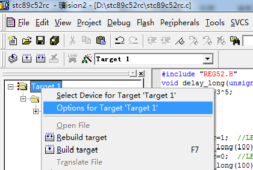
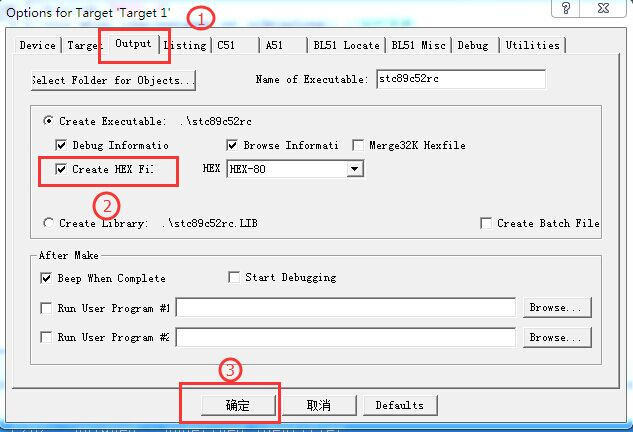
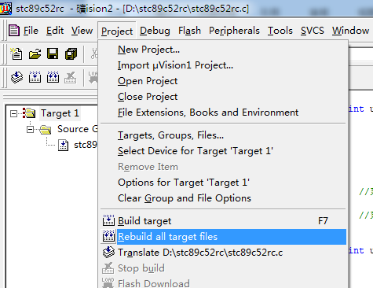
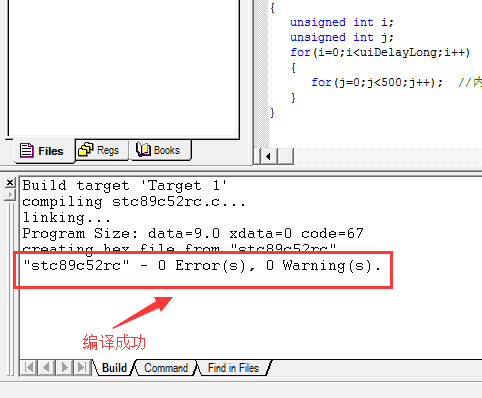
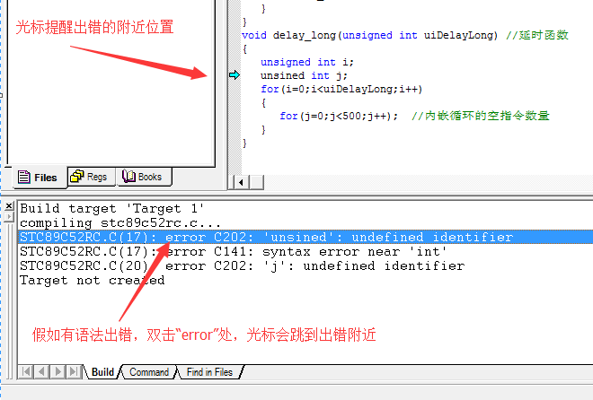
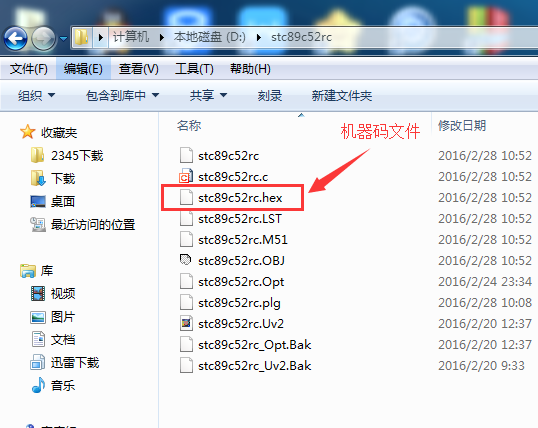
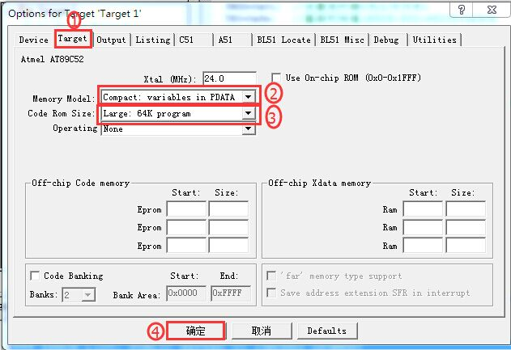

# 第六节：把.c 源代码编译成.hex 机器码的操作流程

## 【6.1 把.c 源代码编译成.hex 机器码的详细步骤】

### 第一步：启动 Keil2 软件

双击桌面”Keil uVision2” 的图标启动 Keil2 软件。

### 第二步：关闭默认被打开的已有工程

启动 Keil2 软件后，如果发现此软件默认打开了一个之前已经存在的工程，请先关闭此工程让 Keil2 软件处于 “空” 的状态，如果没有发现此软件默认打开已有工程，这一步可以忽略跳过。关闭已有工程的操作是这样子的：点击上面”Project” 选项，在弹出的下拉菜单中选择 “Close Project” 即可。这时 Keil2 软件处于 “空” 的状态，没有打开任何工程了。

### 第三步：打开一个现成的工程

点击上面”Project” 选项，在弹出的下拉菜单中选择 “Open Project”，在弹出的文件对话框中，找到需要被打开工程文件夹（本例程是上一节在 D 盘下建的 “stc89c52rc” 文件夹），在此文件夹目录下单击选中 “stc89c52rc.Uv2” 这个工程文件名，然后点击 “打开”，就可以打开一个现有的工程文件了。

▲图 6.1.4.1 把设置窗口调出来

### 第四步：设置编译环境让 Keil2 软件允许产生.hex 格式的机器码文件

鼠标右键点击选中左边选项框里面的”Target 1” 选项，在右键下拉菜单中选择 “ Options for Target‘Target 1’ ” 选项，弹出一个编译环境设置对话框，左键单击上面子菜单切换到 “Output” 窗口下，把 “Create Hex File” 勾选上。点击 “确定”。

▲图 6.1.4.2 勾选上能生成 HEX 机器码的选项

补充说明：

（1）这个选项很重要，必须把 “Create Hex File” 选项勾上，否则后续的操作不能在工程文件夹的目录里生成.Hex 的机器码文件。对于一个文件夹的工程模板，只需要设置一次就可以保存起来了，下次开电脑重新打开此工程模板时不需要再设置，这些被设置的参数都是能掉电保存起来的。

### 第五步：启动编译

在确保 stc89c52rc.c 源文件里面有 C 语言源代码的情况下（如果没有，请先复制上一节的例程源代码），点击上面”Project” 选项，在弹出的下拉菜单中点击 “Rebuild all target files” 编译命令，编译器开始编译工作。

▲图 6.1.5.1 重新编译所有的文件

### 第六步：在”Output Window” 窗口下观察编译结果

可以在最下方的”Output Window” 窗口下观察到编译的过程提示。”Output Window” 窗口默认出现在源代码区的最下方，如果没有发现”Output Window” 窗口，请把鼠标的光标移动到最下方的滑动条下边，当它呈现移动光标的形状时，按住左键往上拖动就可以看到 “Output Window” 窗口了。当 “Output Window” 窗口最后一行显示 “"stc89c52rc" - 0 Error (s), 0 Warning (s).” 等信息时，表示翻译工程结束了。其中 0 Error (s) 代表编译成功，没有任何错误。0 Warning (s) 代表没有任何警告。

▲图 6.1.6.1 编译成功

补充说明：

（1）只要有一个错误 Error 产生，就说明编译不通过。如果没有任何错误 Error 产生，但是有几个警告 Warning 产生，在这种情况下很多时候都不影响程序的正常运行，只有少数情况下是会影响代码的正常运行的，因此我本人建议哪怕是一个警告，大家也不要放过它，也要找到产生这个警告的原因。

▲图 6.1.6.2 双击出错提示那行自动跳转到错误附近

（2）查找错误的时候，只需要双击错误提示 error 那行内容，光标就会自动跳到源代码错误的附近，方便大家寻找语法错误。

（3）还有一种很实用的方法，就是直接把提醒出错那一整行英文复制粘贴到网上去搜索，往往能搜索到所需的正确答案或者重要提示。

### 第七步：编译后生成.hex 机器码文件的目录位置

以上编译成功后，只要打开电脑 D 盘的 stc89c52rc 文件夹，就可以找到.hex 扩展名的机器码文件，这个文件就是我们要下载到单片机的机器码文件。

▲图 6.1.7.1 这个就是我们需要的 HEX 机器码烧录文件

## 【6.2 注意！最后，还有一个非常重要的 Keil 编译环境需要设置】

STC89C52 单片机与 AT89C52 单片机是兼容的，它们的 ROM 程序容量都是 8K 字节，而它们的 RAM 数据容量是不一样的，STC89C52 的 RAM 是 512 字节，而 AT89C52 的 RAM 是 256 字节，尽管两者的 RAM 容量有一些小差异，但是对于我们用作入门学习来说，这些都是无所谓的，所以本教程硬件平台虽然是用 STC89C52 单片机，但是 Keil 的编译环境其实是用 AT89C52 的芯片环境，因此本教程就以 AT89C52 为准。 刚才提到 AT89C52 的程序容量 ROM 是 8K 字节，数据容量 RAM 是 256 字节，那么问题来了，很多初学者经常遇到，有一些程序代码 ROM 明明没有超过 8K, 或者数据容量 RAM 明明还没超过 256 字节，编译器居然报错提醒容量不够！什么原因？怎么解决？

什么原因？是单片机的内存分配模式问题引起的，具体原因暂时不深入讲解。

怎么解决？有一个非常重要的 Keil 编译环境需要设置一下，设置步骤是：

▲图 6.2.1 设置编译器的 RAM 和 ROM 容量大小的模式

如上图所示，在一个已经打开的工程里，鼠标右键点击选中左边选项框里面的”Target 1” 选项，在右键下拉菜单里选择 “ Options for Target‘Target 1’ ” 选项，弹出一个编译环境设置对话框，第一步单击上面子菜单切换到 “Target” 窗口下，第二步在 Memory Model 选项的下拉菜单里选中 “Compact: variables in PDATA”，第三步在 Code Ram Size 选项的下拉菜单里选中 “Large: 64K program”，第四步点击 “确定”。

## [◀回到目录](https://xdrive5.github.io/mcu_frame_2019/000.目录)
上一篇：[005.用 Keil2 软件关闭，新建，打开一个工程的操作流程](https://xdrive5.github.io/mcu_frame_2019/005.用%20Keil2%20软件关闭，新建，打开一个工程的操作流程)

下一篇：[007.预留](https://xdrive5.github.io/mcu_frame_2019/007.预留)

***
