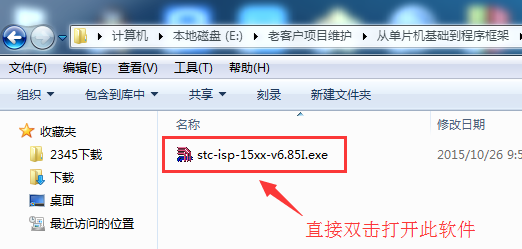

# 第八节：把.hex 机器码程序烧录到单片机的操作流程

## 【8.1 烧录程序的本质】

“烧录” 是比较专业的说法，很多初学者第一次听这词还以为跟火有关，莫名其妙的 “烧录” 是啥意思？烧录其实就是下载，烧录程序就是下载程序。下载好理解了吧，下载电影，下载歌曲，让播放器去播放。此处的下载程序跟下载歌曲的 “下载” 完全是一回事。有人会问，下载歌曲到手机，手机是成品，下载程序到单片机，单片机也是成品？新买回来的单片机不是一张白纸的电子元件吗？其实，新买回来的单片机就是一个成品，它不是白纸，它内部已经嵌入了一段系统程序，这个系统程序就像你刚买回来的手机就帮你预装了安卓系统一样，只是它的用户存储区是空白的。比如手机，你往这个存储区里存电影就可以看电影，存音乐就可以听音乐。比如单片机，你往这个存储区存不同的程序就可以让单片机做不同的事。而预装在新单片机内部的系统程序就是专门负责跟外部接口通讯，同时负责把 hex 格式的程序代码存放在单片机内部正确的位置，这个就是烧录程序 (下载程序) 的本质。这样一比喻，所以.hex 格式的烧录文件跟.MP3 格式的音乐文件在存储本质上是一样的。

再回顾总结一下，烧录程序的本质是：把单片机当做一个存储器，每一条程序指令都对应一个唯一的存储地址，把这些指令以字节为单位一条条存储到指定的存储地址中，这就是烧录程序的本质。对于 STC89C52RC 单片机，在下载程序时需要上位机软件和一根 USB 转串口线。上位机软件负责把.hex 格式的机器码文件打开，机器码文件里面记录着每条程序指令所对应的地址信息，下载过程时，上位机软件根据.hex 文件记录的指令内容和对应的地址信息，经过 USB 转串口线，跟单片机的预置系统程序进行串口通讯，从而把.hex 记录的信息传输到单片机内部的 flash 存储器中，实现了程序的烧录下载。

## 【8.2 烧录程序所需的工具和软件】

### （1）装有 XP 或者 WIN7 系统的电脑一台

其它更高系统的我还没测试过，应该问题也不大。

▲图 8.2.2 带串口的单片机最小系统

### （2）带 9 针串口、1 颗 LED 灯、电源拨动开关、能 5V 电源供电的 stc89c52rc 单片机核心板一块

单片机的学习离不开硬件平台的编程练习，本教程用的学习板原理图已经分享到网上连载贴的附件资料里。大家也可以根据原理图自己焊接一块学习板来学习，或者用其它厂家带有串口的单片机学习板来学习。

串口是用来单片机跟电脑通讯的接口，是 STC89C52RC 单片机下载程序的通道。LED 灯用来观察单片机是否正常运行程序。电源拨动开关方便烧录程序时提供所需的断电和上电的操作。本单片机系统是 5V 供电。

▲图 8.2.3 USB 转串口线

### （3）主控芯片是 CH340 的 USB 转 RS232 串口线一条

我之所以推荐主控芯片是 CH340 的 USB 转 RS232 串口线，因为 CH340 的下载线在烧录程序时很稳定可靠。这款 USB 转串口线可以在淘宝购买到。

▲图 8.2.4 USB 取电的电源线

### （4）5V 供电的 USB 电源线一条

此 USB 线可以从电脑的 USB 口取电，也可以从输出 5V 的手机充电器处取电。但是我建议大家用输出 5V 的手机充电器来供电，因为很多电脑的 USB 口供电干扰比较大，会影响程序烧录。

▲图 8.2.5 USB 转串口的驱动安装程序

### （5）主控芯片是 CH340 的 USB 转 RS232 串口线驱动安装程序

此驱动程序 USB 转 RS232 串口线的厂家通常都会提供，但是建议用我在附件资料里推荐给大家的驱动程序，毕竟这个程序经过我本人验证测试过。

▲图 8.2.6 上位机软件

### （6）烧录程序和串口助手功能都具备的 “stc-isp-15xx-v6.85I” 上位机软件

这是宏晶单片机官方免费提供的上位机软件，可以在宏晶单片机的官网上下载获取。这款软件有很多功能，除了有下载程序和串口助手的功能外，还可以用来配置自动生成所需的初始化代码。当然，本教程后面主要是用到此软件的下载程序和串口助手这两个功能。所以大家所选的软件版本必须是 v6.85I 版本或者以上的版本，因为早些年有一些版本只有烧录功能但是没有串口助手的功能。

## 【8.3 把.hex 文件烧录到单片机的操作流程】

前面第 6 节内容已经教大家把一个驱动 LED 灯闪烁的 C 源代码编译成.hex 文件的操作流程，同时在 D 盘的 “stc89c52rc” 文件夹里已经生成了一个 “stc89c52rc.hex” 的机器码文件，现在就要教大家如何烧录此文件到单片机内。此程序的功能是让单片机驱动一颗 LED 灯闪烁。

▲图 8.3.1.1 双击安装 USB 转串口驱动程序的启动图标

▲图 8.3.1.2 安装 USB 转串口驱动程序

▲图 8.3.1.3 驱动程序安装成功

### 第一步：安装 USB 转串口驱动程序

上位机 “stc-isp-15xx-v6.85I” 烧录软件就是安装在电脑端的用户软件，电脑跟单片机进行通讯，需要一根 USB 转串口线，欲使 USB 转串口线正常工作，必须预先安装 USB 转串口的驱动程序。具体的操作是这样的：在本连载贴附件资料处下载 “USB 转串口的驱动程序 CH340.zip” 文件压缩包，解压后打开此文件夹，找到 “SETUP.EXE” 这个安装应用程序，双击启动，在弹出的界面中，单击 “安装” 按钮即可完成驱动程序的安装。

▲图 8.3.2.1 打开 WIND7 系统电脑的管理窗口

▲图 8.3.2.2 打开设备管理器窗口

▲图 8.3.2.3 查看 COM 口号

▲图 8.3.2.4 记录当前正用到的 COM 口号

###  第二步：硬件线路连接，同时记录串口号

 把 USB 转串口线插入电脑 USB 口，此时 USB 转串口线的另外一端连接 51 学习板的 9 针串口。同时，电源线一端用输出的 5V 手机充电器 USB 端口供电，电源线另一端连接 51 学习板的 USB 供电端口，此时可以通过 51 学习板的电源拨动开关来控制断电和上电。然后是查找串口号，方法是：以电脑 WIN7 系统为例，右击桌面 “计算机”，单击选择下拉菜单的 “管理” 选项，在弹出的窗口中，点击 “设备管理器” 选项切换到对应的设置窗口，双击 “端口（COM 和 LPT）” 选项，在展开的下拉选项中，会看到 “USB-SERTAL CH340 (COM3)”，这个 COM3 就是我们要记住的串口号，记住此串口号，后面的步骤要用到。你们的串口号不一定是 COM3，请以你们电脑显示的串口号为准。

\---------------------------------- 步骤之间的分割线 ----------------------------------------

▲图 8.3.3 双击打开上位机软件

### 第三步：打开上位机用户软件 “stc-isp-15xx-v6.85I.exe”

这个软件可以在宏晶单片机的官网下载获取，获取到的软件压缩包只需解压后就可以使用，不用安装，

直接双击打开 “stc-isp-15xx-v6.85I.exe”，此时会弹出 “温馨提示” 的窗口，我们按 “确定” 就可以进入到真正的工作界面了。

▲图 8.3.4 设置烧录（下载）选项

###  第四步：选择单片机型号

 在 “单片机型号” 的下拉菜单中选择 “STC89C/LE52RC” 这个型号。如果中途弹出推荐选用其它型号的窗口，可以忽略它，我们用来学习只要认准 “STC89C/LE52RC” 这个型号就可以了。

###  第五步：设置串口号

 点击 “串口号” 右侧的选项，在 “串口号” 的下拉菜单中，选择跟前面第二步所记录一样的串口号 COM3（你们的串口号不一定是 COM3，请根据你们的电脑实际显示情况来选择）。

###  第六步：设置最低波特率和最高波特率

 “最低波特率” 设置为 2400，,“最高波特率” 设置为 9600。波特率如果设置太高，可能会导致烧录（下载）不成功。

###   第七步：导入.hex 格式的机器码文件

点击 “打开程序文件” 的按钮，在弹出的对话框中，选择 D 盘下 “stc89c52rc” 文件夹目录下的 “stc89c52rc.hex”，双击把 “stc89c52rc.hex” 导入到上位机用户软件。

▲图 8.3.8 等待 51 学习板重新断电再上电

###  第八步：启动下载

点击 “下载 / 编程” 的按钮，发现 “正在检测目标单片机..” 的提示信息，此时需要通过电源波动开关把 51 学习板重新断电然后再上电才能正常下载，很多人也把这个重新上电的过程称为 “冷启动”。之所以要重新断电再上电，是因为单片机内部预置的系统程序只在上电短暂的瞬间才会检查一下是否接收到需要重新烧录程序的指令，如果没有接收到烧录指令，单片机整个话语权就由原来的系统程序转交给我们的用户程序来接管，所以此串口后面的时间就给我们用户程序来使用。因此每次烧录程序时，先启动上位机的下载命令，此时上位机不断发送请求下载的命令给单片机，但是此时单片机并不理会这些指令，因为此时单片机的话语权已经交给了我们的用户程序，此时并不是预置系统程序在掌控，所以除非重新断电然后再上电那一瞬间才会让系统内置程序去检测并且响应此下载命令。另外多说一句，其实不是所有厂家的单片机在烧录程序时都需要 “冷启动”，也不是所有单片机都支持串口烧录，各厂家的单片机烧录程序方式会有一些差异，但基本原理是一样的，大同小异。

▲图 8.3.9 烧录（下载）成功

### 第九步：“冷启动” 后观察是否操作成功的信息

执行完前面第九步的 “冷启动” 后，如果发现有 “... 操作成功！” 的提示信息，就说明程序下载成功了。此时会发现 51 学习板上面的一颗 LED 灯不断闪烁，是因为我们的 LED 灯程序驱动它才开始闪烁的，说明我们的程序在单片机上正常工作了。

补充说明：

* （1）以后只要每次重新编译了 C 源代码后，都会生成最新版本的.hex 格式文件，所以每次烧录程序时，必须重新返回第七步，重新执行一次导入最新版本.hex 格式文件的操作，确保被烧录的程序是最新版本的.hex 烧录文件。

## 【8.4 51 学习板下载程序失败时的解决办法】

- （1）可以先松一下单片机卡座，稍微挪动一下单片机，然后再卡紧单片机。卡座必须卡紧单片机，避免接触不良。
- （2）改变供电电源，很多电脑的 USB 口供电电源干扰非常大，严重影响下载程序，请把 USB 电源线插入到手机充电器 5V 的 USB 接口，效果显著，明显提高了下载的成功率。
- （3）检查确保所选择的单片机型号是 STC89C/LE52RC，如果软件弹出推荐其它型号的单片机窗口，不用管它，我们就选 STC89C/LE52RC。
- （4）检查 STC-ISP 烧写软件是否选择匹配的 COM 口。
- （5）单片机是靠串口烧录程序进去的，单片机的串口是 P3.0,P3.1 两根线经过 232 转换芯片，然后才与 USB 转串口线连接的。因此，在烧录程序时，请确保 P3.0,P3.1 两个 IO 口不能跳线连接到其它外围元器件上。
- （6）点击 “下载 / 编程” 后，记得再断电并且重新上电一次。看看是否烧录成功。
- （7）确保最低波特率一直设置为 2400，最高波特率为 9600。如果还不行再把最高波特率也改成 2400 试试。
- （8）如果还不行，就退出软件，拔掉 USB 转串口线，同时断电（必须把整根电源线拔出！），重新插入 USB 串口线，重新插入电源线开电，重新打开软件。
- （9）如果还不行，学习板先断电（必须把整根电源线拔出！），然后重启一次电脑。
- （10）总之：如果还不行，就按上述步骤多折腾几次。
- （11）最后实在不行，就尝试更换到其它 USB 口，或者尝试更换到其它电脑上试试。

## [◀回到目录](https://xdrive5.github.io/mcu_frame_2019/000.目录)
上一篇：[007.预留](https://xdrive5.github.io/mcu_frame_2019/007.预留)

下一篇：[009.预留](https://xdrive5.github.io/mcu_frame_2019/009.预留)

***
