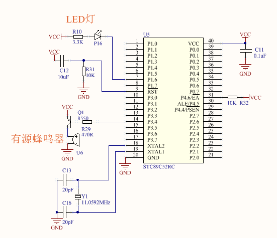

# 第十节：程序从哪里开始，要到哪里去？

程序从哪里开始，要到哪里去？为了让初学者了解 C 语言程序的执行顺序，我把程序分成三个区域：进入主程序前的区域，主程序的初始化区域，主程序的循环区域。当然，这里三个区的分类暂时没有把中断程序的情况考虑进去，中断程序的内容我会在后面相关的章节中再详细介绍，这里暂时不考虑中断。

进入主程序前的区域。这是上电后，在单片机执行主程序代码之前就已经完成了的工作。包括头文件的包含，宏定义，内存分配这些工作。这部分的内容可以暂时不用去了解，我会在后面的一些章节中陆续深入讲解。

主程序的初始化区域。这是上电后，单片机进入主程序后马上就要执行的程序代码，这部分区域的代码有一个特点，大家也必须记住的，就是单片机只执行一次。只要单片机不重启，不复位，那么上电后这部分的代码只被执行一次。

主程序的循环区域。单片机在主程序中执行完了初始化区域的代码，紧接着就进入这片循环区域的代码。单片机一直在逐行循环执行这些代码，执行到末尾时又返回到循环区域的开始处继续开始新一轮的执行，周而复始，往复循环，这就是上电后单片机的最终归宿，一直处在循环的状态。

下面我跟大家分析一个程序源代码的三个区域和执行顺序，大家先看中文解释部分的内容，暂时不用理解每行指令的语法，有个整体的认识就可以了。此源代码实现的功能是：上电后，蜂鸣器鸣叫一声就停止（初始化区域），然后看到一个 LED 灯一直在不停的闪烁（循环区域）。



▲图 10.1 本节示例程序匹配的单片机驱动电路原理图

源代码如下：

```c
#include "REG52.H" // 进入主程序前的区域：头文件包含
sbit beep_dr = P3^4;
// 进入主程序前的区域：宏定义
sbit led_dr = P1^6;
// 进入主程序前的区域：宏定义
unsigned long i;
// 进入主程序前的区域：内存分配
void main () // 主程序入口，即将进入初始化区域 
{
  beep_dr = 0;
  // 第一步：初始化区域：蜂鸣器开始鸣叫。
  for (i = 0; i < 6250; i++);
  // 第二步：初始化区域：延时 0.5 秒左右。也就是蜂鸣器鸣叫的持续时间。
  beep_dr = 1;
  // 第三步：初始化区域：蜂鸣器停止鸣叫。
  while (1) // 执行完上面的初始化区域，即将进入循环区域 
  {
    led_dr = 0;
    // 第四步：循环区域：LED 开始点亮。
    for (i = 0; i<6250; i++);
    // 第五步：循环区域：延时 0.5 秒左右。也就是 LED 点亮的持续时间。
    led_dr = 1;
    // 第六步：循环区域：LED 开始熄灭。
    for (i=0; i < 6250; i++);
    // 第七步：循环区域：延时 0.5 秒左右。也就是 LED 熄灭的持续时间。
  }
  // 执行完上面第七步后，单片机又马上返回到上面第四步继续往下执行。
}
```

上述代码执行顺序分析:

单片机进入主程序后，从第一步到第三步是属于初始化区域，只被执行一次。然后进入循环区域，从第四步执行到第七步，执行完第七步之后，马上又返回上面第四步继续循环往下执行，单片机一直处于第四步到第七步的往复循环中。可以很清晰的看到，上面的 main 和 while (1) 关键词就是三个区域的边界分割线。

经过以上的分析，可以看出这三个区域的大概分布如下：

```c
//... 进入主程序前的区域
void main () 
{
  // 初始化区域
  while (1) 
  {
    // 循环区域
  }
}
```

## [◀回到目录](https://xdrive5.github.io/mcu_frame_2019/000.目录)

上一篇：[009.预留](https://xdrive5.github.io/mcu_frame_2019/009.预留)

下一篇：[011.一个在单片机上练习 C 语言的模板程序](https://xdrive5.github.io/mcu_frame_2019/011.一个在单片机上练习%20C%20语言的模板程序)

***
