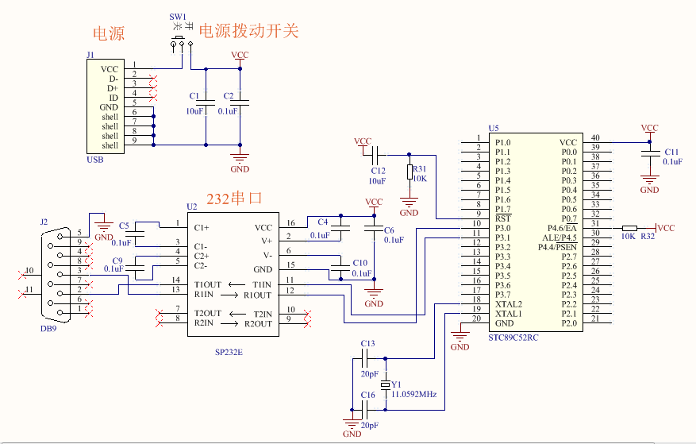
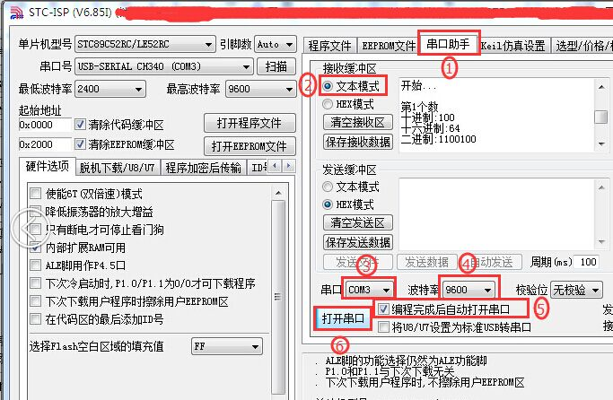

# 第十一节：一个在单片机上练习 C 语言的模板程序

## 【11.1 一套完整的模板源代码。】

先给大家附上一套完整的模板源代码，后面章节练习 C 语言的模板程序就直接复制此完整的源代码，此源代码适合的单片机型号是 STC89C52RC，晶振是 11.0592MHz，串口波特率是 9600，初学者只需修改代码里从 “C 语言学习区域的开始” 到 “C 语言学习区域的结束” 的区域，其它部分不要更改。可复制的源代码请到网上论坛原贴处直接下载本教程的文件压缩包，解压文件压缩包后，直接用 WPS 办公软件打开 “可编辑的 WPS 文档教程” 这个文档，就可以复制里面相关章节的源代码。在网上搜索 “从单片机基础到程序框架” 就可以找到论坛原贴的出处，也可以直接到我的个人网站那里下载（[www.dumenmen.com](http://www.dumenmen.com/) ）。一套完整的模板源代码如下：

```c
#include "REG52.H"
void View (unsigned long u32ViewData);
void to_BufferData (unsigned long u32Data, unsigned char *pu8Buffer,
                   unsigned char u8Type);
void SendString (unsigned char *pu8String);
/*---C 语言学习区域的开始。-----------------------------------------------*/
void main ()  // 主函数 
{
  unsigned char a;// 定义一个变量 a。
  unsigned int b; // 定义一个变量 b。
  unsigned long c;// 定义一个变量 c。
  a = 100;        // 给变量 a 赋值。
  b = 10000;      // 给变量 b 赋值。
  c = 1000000000; // 给变量 c 赋值。
  View (a);       // 把第 1 个数 a 发送到电脑端的串口助手软件上观察。
  View (b);       // 把第 2 个数 b 发送到电脑端的串口助手软件上观察。
  View (c);       // 把第 3 个数 c 发送到电脑端的串口助手软件上观察。
  while (1) 
  {
  }
}
/*---C 语言学习区域的结束。-----------------------------------------------*/
void View (unsigned long u32ViewData) 
{
  static unsigned char Su8ViewBuffer [43];
  code unsigned char Cu8_0D_0A [] = {0x0d, 0x0a, 0x00};
  code unsigned char Cu8Start [] = {"开始..."};
  static unsigned char Su8FirstFlag = 0;
  static unsigned int Su16FirstDelay;
  if (0 == Su8FirstFlag) 
  {
    Su8FirstFlag = 1;
    for (Su16FirstDelay = 0; Su16FirstDelay < 10000; Su16FirstDelay++)
                ;
    SendString (Cu8Start);
    SendString (Cu8_0D_0A);
    SendString (Cu8_0D_0A);
  }
  to_BufferData (u32ViewData, Su8ViewBuffer, 1);
  SendString (Su8ViewBuffer);
  to_BufferData (u32ViewData, Su8ViewBuffer, 2);
  SendString (Su8ViewBuffer);
  to_BufferData (u32ViewData, Su8ViewBuffer, 3);
  SendString (Su8ViewBuffer);
  to_BufferData (u32ViewData, Su8ViewBuffer, 4);
  SendString (Su8ViewBuffer);
  SendString (Cu8_0D_0A);
}
void to_BufferData (unsigned long u32Data, unsigned char *pu8Buffer, unsigned char u8Type) 
{
  code unsigned char Cu8Array1 [] = {0xB5, 0xDA, 0x4E, 0xB8,
                                        0xF6, 0xCA, 0xFD, 0x00};
  code unsigned char Cu8Array2 [] = "十进制:";
  code unsigned char Cu8Array3 [] = "十六进制:";
  code unsigned char Cu8Array4 [] = "二进制:";
  static unsigned char Su8SerialNumber = 1;
  static unsigned int Su16BufferCnt;
  static unsigned int Su16TempCnt;
  static unsigned int Su16TempSet;
  static unsigned long Su32Temp1;
  static unsigned long Su32Temp2;
  static unsigned long Su32Temp3;
  static unsigned char Su8ViewFlag;
  if (1 == u8Type) 
  {
    for (Su16BufferCnt = 0; Su16BufferCnt < 7; Su16BufferCnt++) 
    {
      pu8Buffer [Su16BufferCnt] = Cu8Array1 [Su16BufferCnt];
    }
    pu8Buffer [2] = Su8SerialNumber + '0';
    pu8Buffer [Su16BufferCnt] = 0x0d;
    pu8Buffer [Su16BufferCnt + 1] = 0x0a;
    pu8Buffer [Su16BufferCnt + 2] = 0;
    Su8SerialNumber++;
    return;
  } else if (2 == u8Type) 
  {
    for (Su16BufferCnt = 0; Su16BufferCnt < 7; Su16BufferCnt++) 
    {
      pu8Buffer [Su16BufferCnt] = Cu8Array2 [Su16BufferCnt];
    }
    Su32Temp1 = 1000000000;
    Su32Temp2 = 10;
    Su16TempSet = 10;
  } else if (3 == u8Type) 
  {
    for (Su16BufferCnt = 0; Su16BufferCnt < 9; Su16BufferCnt++) 
    {
      pu8Buffer [Su16BufferCnt] = Cu8Array3 [Su16BufferCnt];
    }
    Su32Temp1 = 0x10000000;
    Su32Temp2 = 0x00000010;
    Su16TempSet = 8;
  } else 
  {
    for (Su16BufferCnt = 0; Su16BufferCnt < 7; Su16BufferCnt++) 
    {
      pu8Buffer [Su16BufferCnt] = Cu8Array4 [Su16BufferCnt];
    }
    Su32Temp1 = 0x80000000;
    Su32Temp2 = 0x00000002;
    Su16TempSet = 32;
  }
  Su8ViewFlag = 0;
  for (Su16TempCnt = 0; Su16TempCnt < Su16TempSet; Su16TempCnt++) 
  {
    Su32Temp3 = u32Data / Su32Temp1 % Su32Temp2;
    if (Su32Temp3 < 10) 
    {
      pu8Buffer [Su16BufferCnt] = Su32Temp3 + '0';
    } else 
    {
      pu8Buffer [Su16BufferCnt] = Su32Temp3 - 10 + 'A';
    }
    if (0 == u32Data) 
    {
      Su16BufferCnt++;
      break;
    } else if (0 == Su8ViewFlag) 
    {
      if ('0' != pu8Buffer [Su16BufferCnt]) 
      {
        Su8ViewFlag = 1;
        Su16BufferCnt++;
      }
    } else 
    {
      Su16BufferCnt++;
    }
    Su32Temp1 = Su32Temp1 / Su32Temp2;
  }
  pu8Buffer [Su16BufferCnt] = 0x0d;
  pu8Buffer [Su16BufferCnt + 1] = 0x0a;
  pu8Buffer [Su16BufferCnt + 2] = 0;
}
void SendString (unsigned char *pu8String) 
{
  static unsigned int Su16SendCnt;
  static unsigned int Su16Delay;
  SCON = 0x50;
  TMOD = 0X21;
  TH1 = TL1 = 256 - (11059200 / 12 / 32 / 9600);
  TR1 = 1;
  ES = 0;
  TI = 0;
  for (Su16SendCnt = 0; Su16SendCnt < 43; Su16SendCnt++) 
  {
    if (0 == pu8String [Su16SendCnt]) 
    {
      break;
    } else 
    {
      SBUF = pu8String [Su16SendCnt];
      for (Su16Delay = 0; Su16Delay < 800; Su16Delay++)
                      ;
      TI = 0;
    }
  }
}
```

## 【11.2 模板程序的使用说明。】



▲图 11.2.1 带串口的单片机最小系统

大多数初学者在学习 C 语言的时候，往往是在电脑端安装上 VC 平台软件来练习 C 语言，这种方法只要在代码里调用 printf 语句，编译后就可以看到被 printf 语句调用的变量，挺方便的。本教程没有用这种方法，既然本教程的 C 语言主要针对单片机，所以我想出了另外一种方法，这种方法就是直接在单片机上练习 C 语言，这样会让初学者体验更深刻。这种方法对硬件平台要求不高，只要 51 学习板上有一个 9 针的串口就可以，这个串口既可以用来烧录程序，也可以用来观察代码里的某个变量，只要在代码里调用 View 函数就可以达到类似 VC 平台软件下 printf 语句的效果，View 函数可以向串口输出某个变量的十进制，十六进制和二进制，大家只要在电脑端的串口助手软件就可以看到某个变量的这些信息，View 函数能查看的变量最大数值范围是 4 个字节的 unsigned long 变量，十进制的范围是从 0 到 4294967295，也可以查看 unsigned int 和 unsigned char 的类型变量（数据的进制以及 long,int,char 等知识点大家目前还没接触到，因此不懂也没关系，当前只要有个大概的认识就可以，暂时不用深入理解，后面章节还会详细介绍）。View 函数是我整个模板程序的其中一部分，所以要用这种方法就必须先复制我整个模板程序，初学者练习代码的活动范围仅仅局限于模板程序里的 “C 语言学习区域”，在此区域里有一个 main 主函数，main 主函数内有一个初始化区域，初学者往往在这个初始化区域里练习 C 语言就够了，初学者最大的活动范围不能超过从 “C 语言学习区域的开始” 到 “C 语言学习区域的结束” 这个范围，

这个范围之外其它部分的代码主要用来实现数据处理和串口发送的功能，大家暂时不用读懂它，直接复制过来就可以了。比如：

```c
/*---C 语言学习区域的开始。-----------------------------------------------*/
void main ()  // 主函数 
{
  //... 初始化区域，也就是主要用来给初学者学习 C 语言的区域。
  while (1) 
  {
  }
}
/*---C 语言学习区域的结束。-----------------------------------------------*/
```

上述例子中，初学者练习代码只能在从 “C 语言学习区域的开始” 到 “C 语言学习区域的结束” 这个范围，此范围外的代码直接复制过来不要更改。我们再来分析分析下面节选的 main 函数源代码：

```c
/*---C 语言学习区域的开始。-----------------------------------------------*/
void main ()  // 主函数 
{
  unsigned char a;// 定义一个变量 a。
  unsigned int b; // 定义一个变量 b。
  unsigned long c;// 定义一个变量 c。
  a = 100;        // 给变量 a 赋值。
  b = 10000;      // 给变量 b 赋值。
  c = 1000000000; // 给变量 c 赋值。
  View (a);       // 在电脑串口端查看第 1 个数 a。
  View (b);       // 在电脑串口端查看第 2 个数 b。
  View (c);       // 在电脑串口端查看第 3 个数 c。
  while (1) 
  {
  }
}
/*---C 语言学习区域的结束。-----------------------------------------------*/
```

上述节选的 main 函数代码里，比如 “a=100; // 给变量 a 赋值。” 这行代码，所谓的 “赋值” 就是 “=” 这个语句，它表面上像我们平时用的等于号，实际上不是等于号，而是代表 “给” 的意思，把 “=” 符号右边的数复制一份给左边的变量，比如 “a=100;” 就是代表把 100 这个数值复制一份给变量 a，执行这条指令后，a 就等于 100 了。这里的分号 “;” 代表一条程序指令的结束。 而双斜线 “//” 是注释语句，双斜线 “//” 这行后面的文字或字符都是用来注释用的，编译器会忽略双斜线 “//” 这一行后面的文字或字符，编译器不把注释文字或字符列入源代码，也就是 “//” 这一行中后面的文字或字符是不占单片机内存的。当然 “//” 仅仅局限于当前一行代码。上面除了 “//” 是注释语句外，上面的 “`/*`” 和 “`*/`” 之间也是注释语句，跟”//” 的作用一样，只不过 “`/*`” 是注释开始，“`*/`” 是注释结束，它们的范围不局限于一行，而是从 “`/*`” 到 “`*/`” 的范围，因此可以用于注释连着的多行文字或者字符。

接着在分析上述代码中最重要的函数，也是本节最核心最重要的函数 View (某个变量)。比如 “ View (a); ” 这行代码，View (a) 就是要把变量 a 的十进制，十六进制和二进制的数值都发送到串口，我们通过 USB 转串口线让学习板连接上电脑，在电脑串口助手软件上就能看到被 View 函数调用的变量 a 的信息。

## 【11.3 如何在电脑上使用串口助手软件查看被 View 函数调用的变量？】

前面章节在讲烧录程序时提到一个叫 “stc-isp-15xx-v6.85I” 的上位机软件，这个软件除了用来烧录程序，还集成了串口助手软件的功能。所以本节直接共用烧录程序时的 USB 转串口线和 “stc-isp-15xx-v6.85I” 软件就可以了，无需额外再购买新的 USB 转串口线和下载其它串口助手软件，但是如何设置这个 “stc-isp-15xx-v6.85I” 上位机软件，还是有一些需要特别注意的地方的，现在把这个详细的步骤介绍给大家。

第一步：设置烧录软件的选项。

按前面章节介绍烧录程序时所需的步骤，用 USB 转串口线连接 51 学习板和电脑，记录 COM 号，打开 “stc-isp-15xx-v6.85I” 软件，选择单片机型号，选择对应的串口号（COM 号），设置最低波特率和最高波特率，这部分的内容跟烧录程序时的配置步骤是一样的，唯一必须要特别注意的是最高波特率必须选择 9600！最低波特率建议选择 2400。否则在烧录完程序后，当上位机集成软件自动切换到串口助手软件窗口时，接收区域显示的一些汉字信息可能会出现乱码。

---------------------------------- 步骤之间的分割线 ----------------------------------------



▲图 11.3.2 设置上位机的串口助手选项

第二步：设置串口助手软件的选项。

先点击右上方选中 “串口助手” 选项切换到串口助手的窗口，接收缓冲区选择 “文本模式”，串口选择匹配的 COM 号（跟烧录软件一致的 COM 号），波特率必须选择 9600，勾选上 “编程完成后自动打开串口” 选项，最后点击 “打开串口” 按钮使之切换到显示 “关闭串口” 的文字状态，至此串口助手软件的设置完毕。接下来就是按烧录程序的流程，打开新的 HEX 程序文件，程序烧录完成后上位机软件会自动切换到串口助手的串口，就可以观察到 View 函数从单片机上发送过来的某个变量的十进制，十六进制，二进制的信息了。接收缓冲区的窗口比较小，如果收到的信息比较多，只要在上下方向拖动窗口右边的滑块就可以依次看到全部的信息。如果想让单片机重新发送数据，只要让 51 学习板断电重启就可以重发一次数据，当串口助手的接收区接收的信息太多影响观察时，大家可以点击 “清空接收区” 的按钮来清屏，然后断电重启让它再重发一次数据。在电脑的串口助手软件里观察到的数据格式大概是什么样子的呢？比如编译完本章节上述完整的模板源代码程序后，会在串口助手软件里看到 a,b,c 三个变量的信息如下：

开始...
>
第 1 个数
十进制：100
十六进制：64
二进制：1100100
第 2 个数
十进制：10000
十六进制：2710
二进制：10011100010000
第 3 个数
十进制：1000000000
十六进制：3B9ACA00
二进制：111011100110101100101000000000

多说一句，烧录程序后，当软件自动切换到串口助手软件选项的窗口时，串口助手窗口显示单片机返回的信息，这时有可能第一行的文字 “开始...” 会丢失或者显示不出来，但是后面其它的关键信息不受影响，我猜测可能是串口助手软件本身的某个环节存在的小 bug，跟我们没关系，我们不用深究原因，因为不会影响我们的使用，此时也有一种解决办法，就是只要让单片机断电重启重发一次数据就可以正确地看到第一行的文字 “开始...”。

## 【11.4 如何利用现有的工程编辑编译新的源代码？】

本教程后面有很多章节的源代码，是不是每个章节都要重新建一个工程？其实不用。我们只要用一个工程就可以编译编辑本教程所有章节的源代码。方法很简单，就是打开一个现有的工程，用快捷组合键 “Ctrl+A” 把原工程里面的 C 源代码全部选中，再按 “Backspace” 清空原来的代码，然后再复制本教程相关章节的代码粘贴到工程的 C 文档里，重新编译一次就可以得到对应的 Hex 格式的烧录文件。用这种方法的时候，建议大家做好每个程序代码的备份。每完成一个项目的小进度，都要及时把源代码存储到电脑硬盘里，电脑硬盘里每个项目对应一个项目文件夹，每个项目文件夹里包含很多不同版本编号的源代码文件，每个源代码文件名都有流水编号，方便识别最新版本的程序，每天下班前都要把最新版本的源代码文件上传到自己的网盘里备份，在互联网时代，把源代码存到自己的网盘，可以随时异地存取，即使遇到电脑故障损坏也不担心数据永久丢失。

## 【11.5 编辑源代码的 5 个常用快捷键。】

介绍一下常用的快捷键，好好利用这 5 个快捷键，会让你在编辑源代码时效率明显提高。

（1）选中整篇所有的内容：组合键 Ctrl+A。

（2）把选中的内容复制到临时剪贴板：组合键 Ctrl+C。

（3）把临时剪贴板的内容粘贴到光标开始处：组合键 Ctrl+V。

（4）把选中的一行或者几行内容整体往右边移动：单键 Tab。每按一次就移动几个空格，很实用。

（5）把选中的一行或者几行内容整体往左边移动：组合键 Shift+Tab。每按一次就移动几个空格，很实用。

## [◀回到目录](https://xdrive5.github.io/mcu_frame_2019/000.目录)

上一篇：[010.程序从哪里开始，要到哪里去？](https://xdrive5.github.io/mcu_frame_2019/010.程序从哪里开始，要到哪里去？)

下一篇：[012.变量的定义和赋值](https://xdrive5.github.io/mcu_frame_2019/012.变量的定义和赋值)

***
